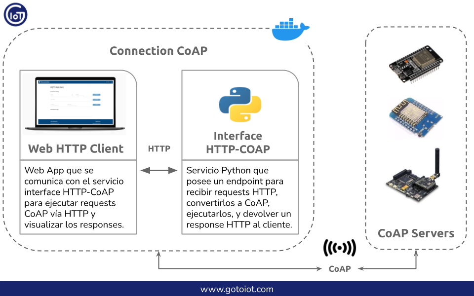
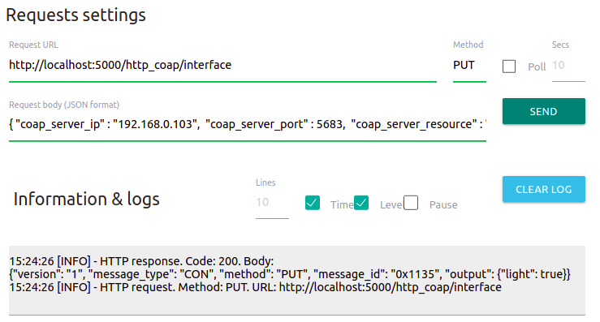

<a href="https://www.gotoiot.com/">
    
</a>

Connection CoAP
===============

*Ayudaría mucho si apoyaras este proyecto con una ⭐ en Github!*

Este proyecto es un ecosistema que posee aplicaciones y servicios que trabajan en conjunto para formar una plataforma integral CoAP. 

Está formado por un servicio que permite ejecutar requests CoAP mediante una interfaz HTTP, y por un cliente web HTTP que sirve para comunicarse con el servicio de interfaz HTTP-CoAP. Los servicios corren sobre el ecosistema Docker que te permiten ejecutarlos de igual manera en diferentes plataformas. 

Para que tengas una idea clara, en esta imagen hay un diagrama de como interactuan las partes entre sí.



> Para que esta aplicación funcione, deberías contar con un server CoAP corriendo en la misma red que esta aplicación.

## Comenzando 🚀

Esta sección es una guía con los pasos escenciales para que puedas poner en marcha la aplicación.

<details><summary><b>Mira los pasos necesarios</b></summary>

### Instalar las dependencias

Para correr este proyecto es necesario que instales `Docker` y `Docker Compose`. 

En [este artículo](https://www.gotoiot.com/pages/articles/docker_installation_linux/) publicado en nuestra web están los detalles para instalar Docker y Docker Compose en una máquina Linux. Si querés instalar ambas herramientas en una Raspberry Pi podés seguir [este artículo](https://www.gotoiot.com/pages/articles/rpi_docker_installation) de nuestra web que te muestra todos los pasos necesarios.

En caso que quieras instalar las herramientas en otra plataforma o tengas algún incoveniente, podes leer la documentación oficial de [Docker](https://docs.docker.com/get-docker/) y también la de [Docker Compose](https://docs.docker.com/compose/install/).

Continua con la descarga del código cuando tengas las dependencias instaladas y funcionando.

### Descargar el código

Para descargar el codigo, lo más conveniente es realizar un `fork` de este proyecto a tu cuenta personal haciendo click en [este link](https://github.com/gotoiot/connection-coap/fork). Una vez que ya tengas el fork a tu cuenta, descargalo desde la terminal con este comando (acordate de poner tu usuario en el link):

```
git clone https://github.com/USER/connection-coap.git
```

Cuando tengas el código principal, descargá/actualizá los submódulos del proyecto con este comando y continua con la ejecución de la aplicación una vez que descarguen:

```
git submodule update --init --recursive --remote
```

> En caso que no tengas una cuenta en Github podes clonar directamente este repo y descargar los submódulos.

### Ejecutar la aplicación

Lo primero que tenés que hacer para correr la aplicación es compilar los servicios necesarios. Abrí una terminal en la raíz del proyecto y ejecutá este comando para compilar (esta acción puede demorar unos minutos dependiendo tu conexión a internet):

```
docker-compose build http-coap-interface
```

Una vez compilado, tenés que correr el comando `docker-compose up`, que va a descargar la imágen de Docker para el cliente HTTP y luego poner en funcionamiento los servicios. Para acceder al cliente web ingresa a esta URL [http://localhost:5001/](http://localhost:5001/) en el navegador (cambia la IP de la URL si la estás corriendo de manera remota). 

Si pudiste acceder al cliente web significa que la aplicación se encuentra corriendo bien. 

</details>

Continuá explorando el proyecto una vez que lo tengas funcionando.


## Información principal 🔍

En esta sección vas a encontrar la información para entender y configurar el proyecto.

<details><summary><b>Mira los detalles</b></summary>

### Cofiguración del Web HTTP Client

El cliente web HTTP permite ejecutar requests para interactuar con el server CoAP a través de la interfaz HTTP-CoAP. Si bien en este proyecto sirve para comunicarse con el servicio HTTP-CoAP Interface, es un cliente HTTP genérico que se puede comunicar con otros servicios. Más abajo, en el apartado "Comunicación entre Connection CoAP y Server CoAP" vas a encontrar todos los detalles para poder enviar los request HTTP al servicio de interfaz HTTP-CoAP, que sean procesados por el server CoAP y que te llegue la respuesta en formato JSON.

Si querés saber más detalles sobre el cliente HTTP podes ir al [README del proyecto](https://github.com/gotoiot/web-http-client).

### Configuración del HTTP-CoAP Interface

A grandes rasgos, el servicio `service-http-coap-interface` es una interfaz que sirve para interactuar con un servidor CoAP desde un cliente HTTP como puede ser un navegador web, o cualquier otro tipo de cliente. Tiene una `HTTP REST API` como interfaz que te permite enviar requests CoAP hacia un servidor y devuelve la respuesta del servidor formateada adecuadamente en JSON para que la puedas interpretar. Está desarrollado en `Python` y se ejecuta sobre un contenedor de `Docker`. 

Más allá de estos resumidos detalles, en el [README del proyecto](https://github.com/gotoiot/service-http-coap-interface) vas a encontrar toda la información relevante del servicio, por lo que es conveniente que lo leas para tener un mejor contexto de cómo funciona. En la [sección de configuración](https://github.com/gotoiot/service-http-coap-interface#configuraci%C3%B3n-de-la-aplicaci%C3%B3n) vas a encontrar detalles sobre qué significa cada una de las variables de configuración de la aplicación, y en la sección [interfaz HTTP](https://github.com/gotoiot/service-http-coap-interface#interfaz-http) vas a poder ver todos los recursos HTTP que posee el servicio y con qué métodos y datos acceder a cada endpoint.

Así mismo, el archivo `service-http-coap-interface/test/other/requests.http` contiene todos los requests para acceder al servicio utilizando la extensión REST Client de Visual Studio Code, la cual es una forma muy conveniente de comunicarte.

### Crear Servidor CoAP basado en "Embed IoT Core"

Dentro de nuestros proyectos tenemos a [Embed IoT Core](https://github.com/gotoiot/embed-iot-core), que es una plataforma exclusivamente dedicada al desarrollo de aplicaciones embebidas orientadas a IoT. En este proyecto hay aplicaciones de ejemplo para distintos protocolos de comunicación; está optimizado para funcionar en una placa `ESP32` o similar y utiliza la herramienta `PlatformIO` para el manejo de bibliotecas, compilación y descarga del código a la placa y muchas cosas más. 

Si contás con una placa y querés poner en marcha una aplicación embebida para conectarte, te recomendamos que le des una mirada al [README del proyecto](https://github.com/gotoiot/embed-iot-core), que tiene toda la información para que entiendas de qué se trata, cómo descargar el código e instalar las dependencias, y cómo poner en marcha un ejemplo de prueba.

Cuando tengas andando el ejemplo de prueba, podés elegir algunas de las aplicaciones CoAP dentro de la [lista de aplicaciones](https://github.com/gotoiot/embed-iot-core#lista-de-aplicaciones), donde vas a encontrar información para ejecutar un servidor CoAP con distintos recursos.

La info necesaria para configurar y correr las diferentes aplicaciones la vas a encontrar directamente en el README del proyecto, así podés acceder siempre a la información actualizada. 

### Comunicación entre Connection CoAP y Servers CoAP

Una vez que hayas puesto en marcha un server CoAP - ya sea un CoAP Server usando el proyecto Embed IoT Core o cualquier otro servidor - dentro de la misma red  donde está corriendo esta aplicación, es momento de realizar requests desde el cliente web HTTP hacia el server CoAP.

Como primera medida, es necesario que sepas los datos del CoAP server correspondientes a su dirección IP, el puerto, los recursos que dispone y los métodos con los cuales podés acceder a sus recursos. 

Luego, una vez que cuentes con el server CoAP corriendo y con esta aplicación ejecutando con el comando `docker-compose up`, abrí el cliente web HTTP ingresando la URL [http://localhost:5001/](http://localhost:5001/) en el navegador. La interfaz web te va a permitir ejecutar los requests hacia el server CoAP y visualizar su respuesta en el área inferior.

Para comenzar, vas a necesitar cargar la URL del host donde está corriendo el servicio HTTP-CoAP con el valor `http://localhost:5000/http_coap/interface`, cargando el método `PUT` y seteando adecuadamente el body con los campos del CoAP server.

Por supuesto, los campos a cargar para ejecutar un request en el CoAP server varían dependiendo la aplicacion, pero independientemente del server, vas a necesitar cargar los mismos campos. 

Para este ejemplo, te mostramos el valor que debería tener el campo payload para comunicarte a un servidor CoAP en la IP `192.168.0.103`, en el puerto `5683`, con el método `PUT`, sobre el recurso `light` y seteando el valor del payload como `"light": true`.

```json
{
    "coap_server_ip" : "192.168.0.103",
    "coap_server_port" : 5683,
    "coap_server_resource" : "light",
    "coap_method" : "put",
    "coap_payload" : {
            "light": true
        }
}
```

En la imagen a continuación te mostramos el Web HTTP Client con los valores de la interfaz HTTP-CoAP adecuadamente, así como también el payload correspondiente al CoAP Server. También podrás notar que en la parte de `Information & Logs` están las acciones realizadas y la respuesta del CoAP Server.



> El payload configurado para el CoAP Server así como también la respuesta, fueron realizadas a partir de la aplicación [CoAP Server](https://github.com/gotoiot/embed-iot-core/tree/master/examples/coap/coap_server) cargada en el proyecto [Embed IoT Core](https://github.com/gotoiot/embed-iot-core) dentro de nuestra plataforma. Si contás con otro servidor CoAP, necesariamente deberán cambiar las configuraciones sobre el campo payload, y la respuesta será diferente.

</details>

## Información complementaria 📚

En esta sección vas a encontrar información que te va a servir para tener un mayor contexto.

<details><summary><b>Lee esta info</b></summary>

### CoAP

`CoAP` es un protocolo de capa de aplicación de internet especializado para dispositivos restringidos. Permite que los dispositivos - llamados nodos - se comuniquen con internet a través de un protocolo simple que hace foco en varios aspectos propios de IoT. Si querés conocer más al respecto de CoAP podés leer el documento de [Introducción a CoAP](https://www.gotoiot.com/pages/articles/mqtt_intro/index.html) que se encuentra en nuestra web.

### Ejecución de servicios

Los servicios de la aplicación se ejecutan sobre contenedores de Docker, así se pueden desplegar de igual manera en diferentes plataformas. Los detalles sobre cómo funcionan los servicios los podés ver directamente en el archivo **docker-compose.yml** y complementar la información con el README de cada parte de la app.

</details>

## Tecnologías utilizadas 🛠️

En esta sección podés ver las tecnologías más importantes utilizadas.

<details><summary><b>Mira la lista completa de tecnologías</b></summary><br>

* [Docker](https://www.docker.com/) - Ecosistema que permite la ejecución de contenedores de software.
* [Docker Compose](https://docs.docker.com/compose/) - Herramienta que permite administrar múltiples contenedores de Docker.
* [Material Design](https://material.io/design) - Bibliotecas de estilo responsive para aplicaciones web.
* [Python](https://www.python.org/) - Lenguaje en el que están realizados los servicios.

</details>

## Contribuir 🖇️

Si estás interesado en el proyecto y te gustaría sumar fuerzas para que siga creciendo y mejorando, podés abrir un hilo de discusión para charlar tus propuestas en [este link](https://github.com/gotoiot/connection-coap/issues/new). Así mismo podés leer el archivo [Contribuir.md](https://github.com/gotoiot/gotoiot-doc/wiki/Contribuir) de nuestra Wiki donde están bien explicados los pasos para que puedas enviarnos pull requests.

## Sobre Goto IoT 📖

Goto IoT es una plataforma que publica material y proyectos de código abierto bien documentados junto a una comunidad libre que colabora y promueve el conocimiento sobre IoT entre sus miembros. Acá podés ver los links más importantes:

* **[Sitio web](https://www.gotoiot.com/):** Donde se publican los artículos y proyectos sobre IoT. 
* **[Github de Goto IoT:](https://github.com/gotoiot)** Donde están alojados los proyectos para descargar y utilizar. 
* **[Comunidad de Goto IoT:](https://groups.google.com/g/gotoiot)** Donde los miembros de la comunidad intercambian información e ideas, realizan consultas, solucionan problemas y comparten novedades.
* **[Twitter de Goto IoT:](https://twitter.com/gotoiot)** Donde se publican las novedades del sitio y temas relacionados con IoT.
* **[Wiki de Goto IoT:](https://github.com/gotoiot/doc/wiki)** Donde hay información de desarrollo complementaria para ampliar el contexto.

## Muestas de agradecimiento 🎁

Si te gustó este proyecto y quisieras apoyarlo, cualquiera de estas acciones estaría más que bien para nosotros:

* Apoyar este proyecto con una ⭐ en Github para llegar a más personas.
* Sumarte a [nuestra comunidad](https://groups.google.com/g/gotoiot) abierta y dejar un feedback sobre qué te pareció el proyecto.
* [Seguirnos en twitter](https://github.com/gotoiot/doc/wiki) y dejar algún comentario o like.
* Compartir este proyecto con otras personas.

## Autores 👥

Las colaboraciones principales fueron realizadas por:

* **[Agustin Bassi](https://github.com/agustinBassi)**: Ideación, puesta en marcha y mantenimiento del proyecto.

También podés mirar todas las personas que han participado en la [lista completa de contribuyentes](https://github.com/connection-coap/contributors).

## Licencia 📄

Este proyecto está bajo Licencia ([MIT](https://choosealicense.com/licenses/mit/)). Podés ver el archivo [LICENSE.md](LICENSE.md) para más detalles sobre el uso de este material.

---

**Copyright © Goto IoT 2021** - [**Website**](https://www.gotoiot.com) - [**Group**](https://groups.google.com/g/gotoiot) - [**Github**](https://www.github.com/gotoiot) - [**Twitter**](https://www.twitter.com/gotoiot) - [**Wiki**](https://github.com/gotoiot/doc/wiki)
